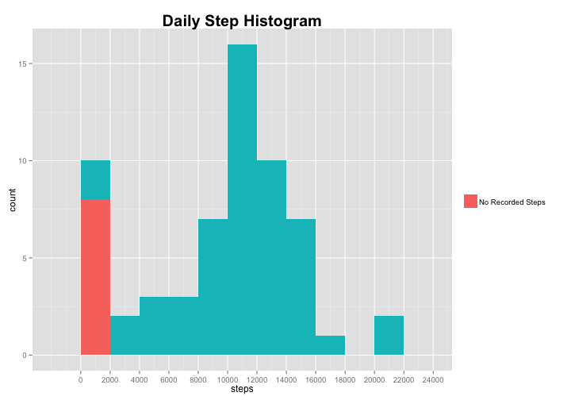
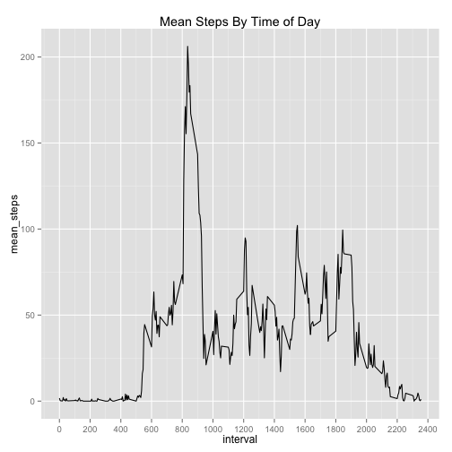
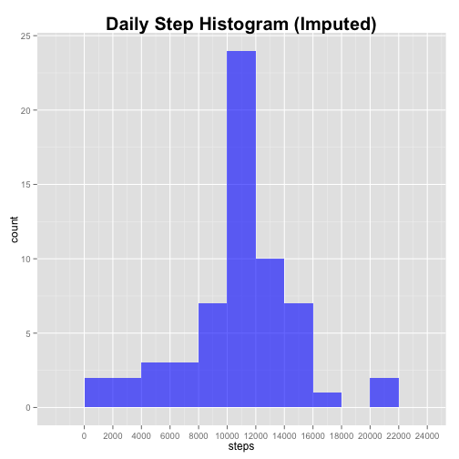
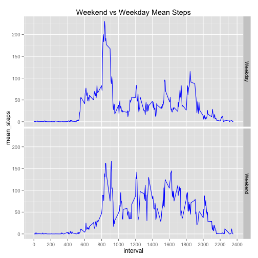

# Reproducible Research: Peer Assessment 1

## Loading and preprocessing the data

First I read in the csv file and name it **Activity**.


```r
Activity <- read.csv("activity.csv", nrows = 17568, colClasses = c("integer", 
    "Date", "integer"))
```


## What is the mean total number of steps taken per day?

Next I create a new dataframe of two columns: date and total steps taken 
that day.


```r
library(plyr)
DailySteps <- ddply(Activity, "date", summarize, sum(steps, na.rm = T))
colnames(DailySteps) <- c("date", "steps")
```


Next I create a histogram of the total steps taken each day and highlight the 
inordinate number of days no steps were reported


```r
library(ggplot2)
DailySteps$tooksteps <- factor(ifelse(DailySteps$steps == 0, 0, 1))
hist <- ggplot(data = DailySteps, aes(x = steps, fill = tooksteps))
hist <- hist + geom_histogram(binwidth = 2000)
hist <- hist + ggtitle("Daily Step Histogram") + theme(plot.title = element_text(size = 20, 
    face = "bold"))
hist + scale_fill_discrete(breaks = c(0), labels = c("No Recorded Steps")) + 
    guides(fill = guide_legend(title = NULL)) + scale_x_continuous(breaks = seq(0, 
    25000, by = 2000))
```

 


Here are the mean and median number of steps taken per day:


```r
mean(DailySteps$steps)
```

```
## [1] 9354
```

```r
median(DailySteps$steps)
```

```
## [1] 10395
```


## What is the average daily activity pattern?

The following code accomplishes three tasks.<br/>
        1. Creates a new dataframe with the mean number of steps per interval <br/>
        2. Plots this timeseries data<br/>
        3. Returns the 5 minute interval with the most steps on average<br/>


```r
IntervalSteps <- ddply(Activity, "interval", summarize, mean(steps, na.rm = T))
colnames(IntervalSteps) <- c("interval", "mean_steps")
line <- ggplot(data = IntervalSteps, aes(x = interval, y = mean_steps))
line <- line + geom_line() + scale_x_continuous(breaks = seq(0, 2400, by = 200))
line + ggtitle("Mean Steps By Time of Day")
```

 

```r
IntervalSteps$interval[which(IntervalSteps$mean_steps == max(IntervalSteps$mean_steps))]
```

```
## [1] 835
```


## Imputing missing values

There are a number of missing step values however.  Let's figure out how many...


```r
sum(is.na(Activity$steps))
```

```
## [1] 2304
```


That's a lot of missing data! Let's impute the missing data with the mean of
their respective intervals.  This will take two steps:<br/>
1. Add a column of interval means to **Activity** using the *join* function and the **IntervalSteps** dataframe we already created. <br/>
2. Impute these interval means for rows that have NA steps<br/>


```r
Activity <- join(Activity, IntervalSteps, by = "interval")
NARows <- is.na(Activity$steps)
Activity$steps[NARows] <- Activity$mean_steps[NARows]
```


With the imputation successfully accomplished.  We can now replot our daily
steps histogram as well as calculate the mean/median daily step values, to see
if imputation caused any drastic changes.


```r
DailySteps2 <- ddply(Activity, "date", summarize, sum(steps, na.rm = T))
colnames(DailySteps2) <- c("date", "steps")
hist <- ggplot(data = DailySteps2, aes(x = steps))
hist <- hist + geom_histogram(binwidth = 2000, fill = "blue", alpha = 0.6)
hist <- hist + ggtitle("Daily Step Histogram (Imputed)") + theme(plot.title = element_text(size = 20, 
    face = "bold"))
hist + scale_fill_discrete(breaks = c(0), labels = c("Zero Steps Recorded")) + 
    guides(fill = guide_legend(title = NULL)) + scale_x_continuous(breaks = seq(0, 
    25000, by = 2000))
```

 

```r
mean(DailySteps2$steps)
```

```
## [1] 10766
```

```r
median(DailySteps2$steps)
```

```
## [1] 10766
```


Both the mean and median have grown considerably.


## Are there differences in activity patterns between weekdays and weekends?
Next I would like to explore the data and see if there is considerable 
difference between the user's weekend and weekday activity.  
To do this we will need to create a logical vector for whether an observation 
occured on the weekend. Let's try this: 


```r
Activity$weekend <- factor(ifelse(weekdays(Activity$date) == "Saturday" | weekdays(Activity$date) == 
    "Sunday", "Weekend", "Weekday"))
```


That seems to have done the trick.  

Next we will create a new dataframe that calculates the mean number of steps 
taken split by both time interval and weekday/weekend.


```r
IntervalSteps2 <- ddply(Activity, c("interval", "weekend"), summarize, mean(steps, 
    na.rm = T))
colnames(IntervalSteps2) <- c("interval", "weekend", "mean_steps")
```


With this new dataframe, we can graph the timeseries step data for both
weekends and weekdays and compare them to see if any major disparities exist.

```r
ggplot(data = IntervalSteps2, aes(x = interval, y = mean_steps)) + geom_line(color = "blue") + 
    facet_grid(weekend ~ .) + ggtitle("Weekend vs Weekday Mean Steps") + scale_x_continuous(breaks = seq(0, 
    2400, by = 200))
```

 


Looks like someone likes to sleep-in and stay up late on the weekends!
